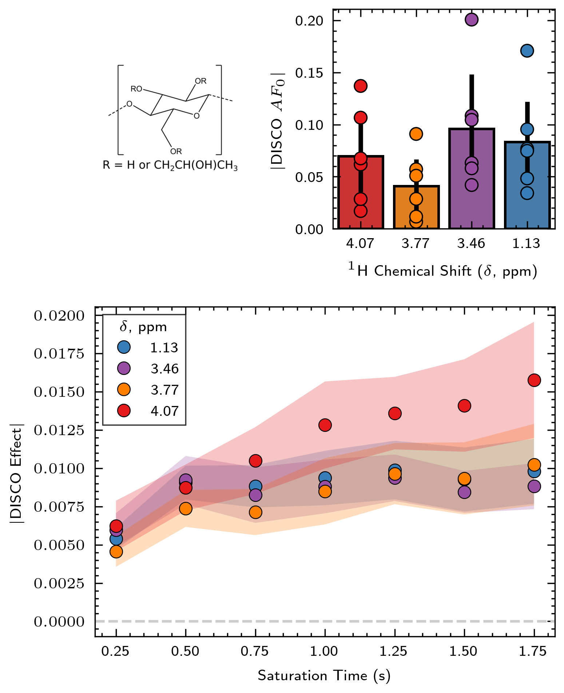
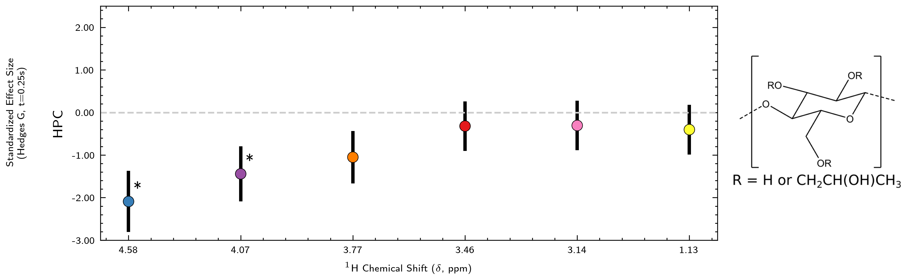

# DISCO Figures 🕺

## About this Repository:
<b> If you have DISCO NMR results to plot, this is the place for you! </b> This repository provides a low-maintenance, customizable template for generating standard DISCO NMR polymer-protein interaction fingerprint plots. 

<!--  -->

## Quickstart:
➡️ There is a fully worked example to generate publication-ready figures in `notebooks/polymer_profiles.ipynb`. 

In it, we regenerate the profiles for hydroxypropyl cellulose (HPC) interactions with mucin protein at two molecular weights.
 
Profiles inlude:
* DISCO Polymer Binding Interaction Fingerprints
* DISCO Polymer Build-Up Curve Plots
* DISCO Polymer Change Profiles (snapshot, and comprehensive versions)

To get a sense of how this repo works, navigate to `notebooks/polymer_profiles.ipynb` and run all cells. Plotting functions are pulled in from the `utils` file. Each plotting utility function contains a descriptive docstring. 

The functions in `utils/plotting.py` are additionally provided with executable examples to give you an intuition for the code.

---
## Plotting with other datasets:
Other polymer-protein interaction profiles from DISCO NMR can be easily plotted with this repo. 
Add any new data files in `data/raw`, read the files into the `polymer_profiles.ipynb` notebook, and make use of our plotting util functions to construct DISCO profile plots.

This template is intended to be an all-in-one place to work on your publication figures for a paper that applies DISCO NMR. 

## Repository Structure

    ├── LICENSE
    ├── README.md          <- The top-level README for this project.
    ├── data
    │   ├── external       <- Any external files (images, etc) required for plotting
    │   └── raw            <- Polymer-specific DISCO NMR experiment result tables
    │
    ├── notebooks          <- Jupyter notebook(s) for constructing plots 
    │   └── utils          <- Utility functions that plot from result tables
    │       └── plotting.py             <- Core plotting functions
    │       └── plotting_helpers.py     <- Minor plotting functions 
    │       └── wrangle_data.py         <- Functions for data manipulation
    │
    ├── paper              <- Can contain in future any generated analysis as HTML, PDF, LaTeX, etc.
    │   └── figurefiles    <- Generated graphics and figures for main analysis
    │   └── supplementary  <- Generated graphics and figures for supplementary information
    │
    └── requirements.txt   <- The requirements file for reproducing the analysis environment

---

## Project Setup:
1) Click the green "Use This Template" button at the top of the page (if signed in to GitHub) and set up your repo. Alternatively, fork the repo and clone to your machine.

2) In your desired Python environment, run `pip install -r requirements.txt` in Terminal to install prerequisite dependencies for this repository

3) Set up `science-plots` matplotlib style for publication quality formatting:\
    i) Follow the instructions provided by the package author, including installation of LaTex: https://github.com/garrettj403/SciencePlots

4) Set up DISCO Custom Colour Palette:\
    i) find .matplotlib dir on your machine by typing the terminal commands:\
    `>>> python` (activate Python in Terminal)\
    `>>> import matplotlib as mpl`\
    `>>> mpl.get_configdir()` (output referred to as dir)\
    ii) navigate to dir/stylelib (may require you to enable showing hidden files on your machine)\
    iii) move the provided discolib file in this repo to your custom style directory:\
    `notebooks/utils/discolib.mplstyle` to --> `dir/stylelib`

---

## Theory

For a comprehensive description of DISCO NMR and the scientific meaning behind resulting plots, we encourage you to read our related publications:
* [1] J. Watchorn, D. Burns, S. Stuart, and F. X. Gu, “Investigating the Molecular Mechanism of Protein–Polymer Binding with Direct Saturation Compensated Nuclear Magnetic Resonance,” Biomacromolecules, vol. 23, no. 1, pp. 67–76, Jan. 2022. https://doi.org/10.1021/acs.biomac.1c00944

* [2] <i>Mechanistic influence of polymer species, molecular weight, and functionalization on protein-polymer and binding interactions</i>. (Manuscript in Draft)

---

## Data Input Format:
In this release, our raw data tables are automatically-generated outputs from another Python module for disco data processing, currently under development. ⚙️

To maximize ease of use we will continue to maintain format compatibility between the disco data processing module outputs, and input files to this template plotting repository. 

➡️ Feel free to make any customizations as required on your machine for data input formatting, until the data processing module is released.

---

## DISCO Figures in Publications
The following papers use code from DISCO Figures to automate plot generation:

* <i>Mechanistic influence of polymer species, molecular weight, and functionalization on protein-polymer and binding interactions</i>. (Manuscript)

If you use this plotting repo for your paper/thesis, feel free to submit a PR to add it to the list!

---
## Acknowledgements
* The figure styles were made possible with the [Science Plots python repository](https://github.com/garrettj403/SciencePlots) created by J.D. Garrett.
* Custom DISCO colour palette comes from the [Colorbrewer qualitative comparison palette.](https://colorbrewer2.org/#type=qualitative&scheme=Set1&n=9)

## Citing DISCO Figures
It's not neccessary to cite the use of this repo. But in case you want to ...

    @article{DiscoFigures,
      author       = {Samantha Stuart, Jeffrey Watchorn},
      title        = {{Frank-Gu-Lab/disco-figures-template}},
      month        = may,
      year         = 2022,
      publisher    = {GitHub},
      version      = {1.0.0},
      url          = {https://github.com/Frank-Gu-Lab/disco-figures-template}
    }